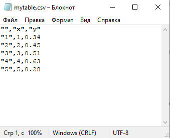

Задание 2
---------

**Вводить ответы сюда**
https://forms.gle/edTiGZFRcwh4YLnYA

## Повторение
**В каждой задаче необходимо написать скрипт и сохранть его под номером задачи**
**Не забудьте перейти в рабочий каталог**

1. Найдите сумму всех чисел от 100 до 200.

2. Создайте вектор $a$ с числами от 1 до 100. Найдите среднее значение выражения $ 3.4a-12.67 $. Результат округлите до сотых.

## Работа с таблицами

Чтобы создать таблицу из нескольких векторов необходимо создать несколько векторов c одинаковым количеством элементов, а затем объединить их в таблицу с помощью команды *data.frame()*.

Пример:

```R
> x <- c(1, 2, 3, 4, 5)
> y <- c(0.34, 0.45, 0.51, 0.63, 0.28)
> t <- data.frame(x, y)
> t
  x    y
1 1 0.34
2 2 0.45
3 3 0.51
4 4 0.63
5 5 0.28
```

Для получния первоначальной информации о данных, которые содержатся в таблице, воспользуйтесь командой *str(имя_таблицы)*.

Пример:

```R
> str(t)
'data.frame':   5 obs. of  2 variables:
 $ x: num  1 2 3 4 5
 $ y: num  0.34 0.45 0.51 0.63 0.28
```

Доступ к столбцам можно снова получить с помощью команды *имя_таблицы$имя_столбца*:

```R
> t$x
[1] 1 2 3 4 5
> t$y
[1] 0.34 0.45 0.51 0.63 0.28
> x_vals <- t$x
> x_vals
[1] 1 2 3 4 5
```

Таблицы обычно содержатся в файлах. Универсальный формат для таких таблиц -- CSV. 

Чтобы записать таблицу в файл используйте команду
*write.csv(имя_таблицы,"имя_файла.csv")*

Пример:

```R
> write.csv(t,"mytable.csv")
```

Посмотреть данные в таблице можно с помощью обычного блокнота:




Чтобы прочитать таблицу из файла используйте команду
*read.csv("имя_файла.csv")*

Пример:

```R
> d <- read.csv("mytable.csv")
> str(d)
'data.frame':   5 obs. of  3 variables:
 $ X: int  1 2 3 4 5
 $ x: int  1 2 3 4 5
 $ y: num  0.34 0.45 0.51 0.63 0.28
```


### Задача
**В каждой задаче необходимо написать скрипт и сохранть его под номером задачи**
**Не забудьте перейти в рабочий каталог**

------------

**Задача 1**
* Создайте таблицу следующую таблицу со значениями времени и уровня сахара в крови
t <- 0 0.1 0.2 0.3 ... 20.0
s <- 4.34 + 0.23*sin(t/5.0)

* Сохраните таблицу в файл "mydata.csv" в рабочем каталоге.

* Откройте таблицу в блокноте и измените названия столбцов на time и sugar. Также переименуйте файл с таблицей на "sugar_data.csv".

------------

**Задача 2**
* Считайте таблицу из файла "sugar_data.csv". Выведите на экран краткую информацию о таблице.
* Найдите наименьшее и наибольшее значение первого столбца таблицы.
* Найдите среднее значение и размах (разницу между наибольшим и наименьшим значениями) второго столбца таблицы.
* Напечатайте информацию на экран с помощью команды *print()*.
* Постройте гистограмму значений уровня сахара в крови с помощью команды *hist()*

---------------

**Вы восхитительны!**
